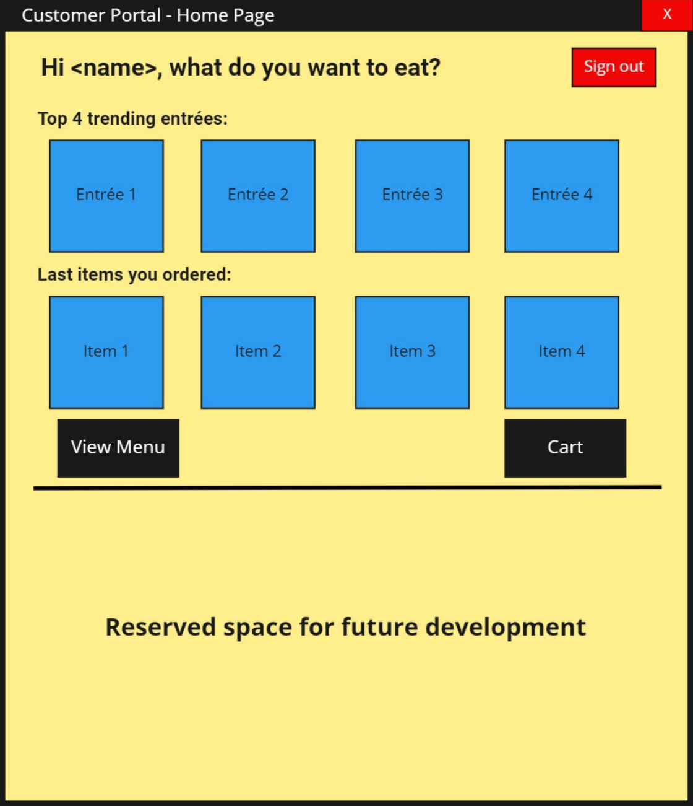

  
  <h3 align="center">McDonaldsDatabaseSystem</h3>
  

    McDonald's customer and manager portal simulated using Java and PostgreSQL.
  

  
Table of Contents

  <ol>
    <li>
      <a href="#about-the-project">About The Project</a>
      <ul>
        <li><a href="#built-with">Built With</a></li>
      </ul>
    </li>
    <li><a href="#usage">Usage</a></li>
    <li><a href="#license">License</a></li>
    <li><a href="#sources">Sources</a></li>
  </ol>

## About the Project

This application simulates both McDonald's business and customer experience. The customer portal includes ordering an item off the menu, adding condiments, and checking out while the manager's portal includes data on trending items, changing details of menu items, and customer look up features. This project was inspired by McDonald's kiosk systems which perform in a similar manner.

### Built With:
* Java
* PostgreSQL
* Apache NetBeans

UML Diagram of the system

Interactions between components

## Usage

Customer Portal User Interface:

Manager Portal User Interface:

## Sources
* Java: [https://www.java.com/en/](https://www.java.com/en/)
* PostgreSQL: [https://www.postgresql.org/](https://www.postgresql.org/)
* Apache NetBeans: [https://netbeans.apache.org/](https://netbeans.apache.org/)
* McDonald’s kiosk ordering system - a UX case study: [https://uxdesign.cc/mcdonalds-kiosk-ordering-system-ui-ux-case-study-fe7b3693f12c](https://uxdesign.cc/mcdonalds-kiosk-ordering-system-ui-ux-case-study-fe7b3693f12c)

### Images
* McDonald’s Logo and Its History: [https://blog.logomyway.com/mcdonalds-logo-history/](https://blog.logomyway.com/mcdonalds-logo-history/)

## License
Distributed under the MIT License. See `LICENSE` for more information.
